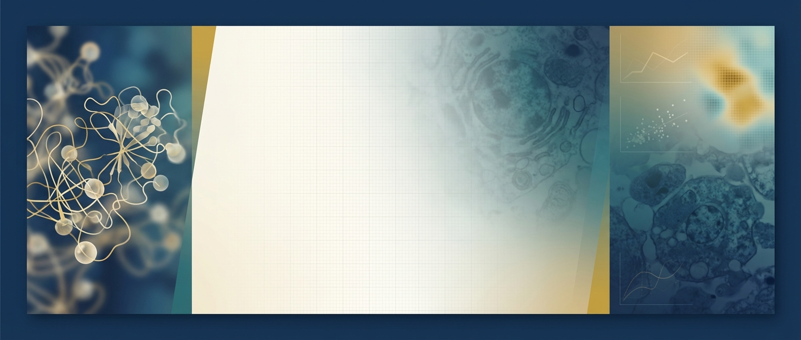

# 🌌 星际联邦生物实验协议 v2.0

> Project Prometheus - 跨维度细胞再生研究

利用量子共振 CCK-8 法评估时空裂隙能量对多维度肿瘤细胞增殖的抑制作用。

本协议是 Airalogy 标准包的完整示例，展示了所有模板类型和功能的使用方法。

## 📁 文件结构

```
complex_example/
├── protocol.toml          # 包描述文件（元数据）
├── protocol.aimd          # 协议文档（Airalogy Markdown）
├── model.py               # Pydantic 变量模型定义
├── assigner.py            # 自动计算逻辑
├── requirements.txt       # Python 依赖
├── README.md              # 本文件
└── files/                 # 📦 静态资源目录（Airalogy 规范）
    ├── logo.png           # 协议 Logo（浅色背景）
    ├── logo_dark.png      # 协议 Logo（深色背景）
    ├── banner.png         # 协议横幅（用于文档头部）
    └── generate_logo.py   # Logo/Banner AI 生成脚本
```

## 📦 静态资源 vs 变量文件

Airalogy 严格区分两种不同类型的文件资源：

### 静态资源 (Static Assets)

协议模板自带的、不可变的资源文件，随协议包一起分发。

| 特点 | 说明 |
|------|------|
| 存储位置 | `files/` 目录（Airalogy 规范） |
| 生命周期 | 与协议版本绑定，不随实验变化 |
| 引用方式 | Markdown 语法 `` |
| 用途 | Logo、Banner、流程示意图、参考图表 |

本协议包含的静态资源：

| 文件 | 用途 | 说明 |
|------|------|------|
| `logo.png` | 协议标识 | 浅色/透明背景，用于亮色主题 |
| `logo_dark.png` | 协议标识 | 深色背景，用于暗色主题 |
| `banner.png` | 文档横幅 | 宽幅图片，用于 protocol.aimd 头部 |

```markdown
<!-- 在 protocol.aimd 中引用静态资源 -->

```

重新生成静态资源：

```bash
# 需要设置 API Key
export YUNWU_API_KEY="your-api-key"
python complex_example/files/generate_logo.py
```

### 变量文件 (Variable Files)

实验者在执行协议时上传或实验过程中产生的文件，存储在 Airalogy 平台。

| 特点 | 说明 |
|------|------|
| 存储位置 | Airalogy 平台云存储 |
| 生命周期 | 与实验记录绑定，每次实验独立 |
| 引用方式 | 变量模板 `{{var\|file_id}}` + `FileId*` 类型 |
| 用途 | 实验照片、原始数据、生成的报告 |
| 存储格式 | `airalogy.id.file.<file_id>.png` |

本协议定义的变量文件字段：

| 字段 | 类型 | 说明 |
|------|------|------|
| `cell_initial_photo` | `FileIdPNG` | 细胞初始状态照片 |
| `cell_before_photo` | `FileIdPNG` | 处理前细胞照片 |
| `cell_after_photo` | `FileIdJPG` | 处理后细胞照片 |
| `raw_data_file` | `FileIdCSV` | 量子光谱仪原始数据 |
| `experiment_video` | `FileIdMP4` | 实验过程视频 |
| `final_report` | `FileIdPDF` | 最终实验报告 |

```python
# 在 model.py 中定义变量文件
from airalogy.types import FileIdPNG, FileIdCSV, FileIdPDF

class VarModel(BaseModel):
    cell_photo: Optional[FileIdPNG]      # 实验者上传的细胞照片
    raw_data: Optional[FileIdCSV]        # 仪器导出的原始数据
    final_report: Optional[FileIdPDF]    # 生成的实验报告
```

### 对比总结

| | 静态资源 | 变量文件 |
|---|---|---|
| 谁提供 | 协议作者 | 实验者 |
| 何时确定 | 协议发布时 | 实验执行时 |
| 是否可变 | ❌ 不可变 | ✅ 每次实验不同 |
| 存储方式 | 本地 `files/` 目录 | 平台 `airalogy.id.file.*` |
| 引用语法 | `` | `{{var\|file_id}}` |
| 典型内容 | Logo、Banner、流程图 | 实验照片、数据、报告 |

## 🚀 快速开始

### 安装依赖

```bash
pip install -r requirements.txt
```

### 测试 Assigner

```bash
python assigner.py
```

### 启动本地服务

```bash
python -m airalogy_mock
```

## 📋 功能演示

### 模板类型

本协议演示了 Airalogy 支持的所有模板类型：

| 类型 | 语法 | 用途 |
|------|------|------|
| 变量 | `{{var\|id}}` | 收集用户输入 |
| 带类型变量 | `{{var\|id: type = default}}` | 带约束的变量 |
| 变量表格 | `{{var\|id, subvars=[...]}}` | 可编辑表格 |
| 步骤 | `{{step\|id}}` | 组织工作流程 |
| 检查点 | `{{check\|id}}` | 关键验证点 |
| 变量引用 | `{{ref_var\|id}}` | 引用变量值 |
| 步骤引用 | `{{ref_step\|id}}` | 引用步骤 |

### Airalogy 自有类型

| 类型 | 用途 |
|------|------|
| `UserName` | 自动填充当前用户 |
| `CurrentTime` | 自动填充当前时间 |
| `FileIdPNG/JPG/CSV/PDF` | 文件上传 |
| `RecordId` | 关联其他记录 |
| `AiralogyMarkdown` | Markdown 编辑器 |
| `PyStr` | Python 代码编辑器 |
| `IgnoreStr` | 敏感数据（不持久化） |

### Assigner 自动计算

- `calculate_inhibition_rates` - 根据量子共振数据自动计算抑制率
- `check_dimension_stability` - 维度稳定性校验
- `check_culture_temperature` - 培养温度校验
- `generate_energy_dilutions` - 自动生成能量梯度配制表
- `estimate_total_time` - 实验时长估算

## 📖 详细文档

- [Airalogy Mock Server 开发指南](../airalogy_mock/docs/airalogy-mock-guide.md)
- [AIMD Studio 模块架构](../aimd_studio/docs/aimd-studio-modules.md)

## ⚠️ 注意事项

- 实验结束后务必关闭所有维度传送门
- 量子共振测量需在时空稳定场强度 > 95% 时进行
- 如遇时空悖论，请立即联系星际联邦时间管理局
